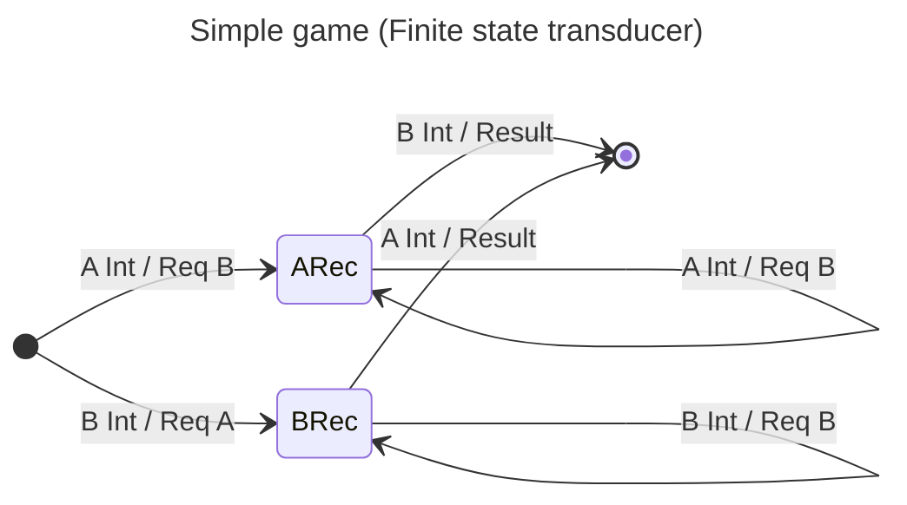

# TODO

- [ ] Learn how to create sum types in Agda so game output is either a PlayerRequest or a Result

# Introduction

This module is an initial exploration on how to define and present all the definitions for a game, a very simplistic game.

So let's start by defining a module and loading all relevant modules

```agda
module simple where

open import Data.Bool using (if_then_else_)
import Data.Nat using (ℕ)
open import Data.Fin
open import Relation.Binary.PropositionalEquality
open import Relation.Nullary
import Relation.Binary.PropositionalEquality as Eq
open Eq using (_≡_; refl; cong; sym)
open Eq.≡-Reasoning using (begin_; _≡⟨⟩_; step-≡; _∎)
```

Let's define a simple game that consist of 2 players. Players will be named after capital letters so we'll have `A` and `B` as players.

```agda
data Player : Set where
  A : Player
  B : Player
```

Players will be able to submit an action that is a number between 0 and 10.

```agda
-- data Move: Player → Set where
--   send : Player → Fin 10 → Move Player
```

Once actions from both players have been received the game engine compares both values and declares winner by telling the user who sent
the max value or declares a Tie when both users picked the same value.

```agda
data Request : Set where
  req : Player -> Request

data Result : Set where
  winner : Player -> Result
  tie : Result

data GameOutput : Set where
  request : Request -> GameOutput
  result : Result -> GameOutput
```
# Operational specification

By using transducers we can specify the game:



# Denotational specification

We have a functions that accepts two numbers and yields a correct evaluation. What exactly is correctness of evaluation?
In other words, what are the logical conditions that define win, lose, or tie in the simplest unambiguous logical terms?

Let me try to write a function for that:

```agda
my-game : Fin 10 -> Fin 10 -> Result
my-game n m = if (does (n <? m)) then winner A else winner B
```

I think that the demostration of the properties of my game would be something like:

```agda
proof-my-game : ∀ (n  m : Fin 10)
   → n < m
   -----------
   → my-game n m ≡ winner A
proof-my-game n m n<m = begin
   my-game n m ≡⟨⟩
   if (n<m) then winner A else winner B ≡⟨⟩
  ```
