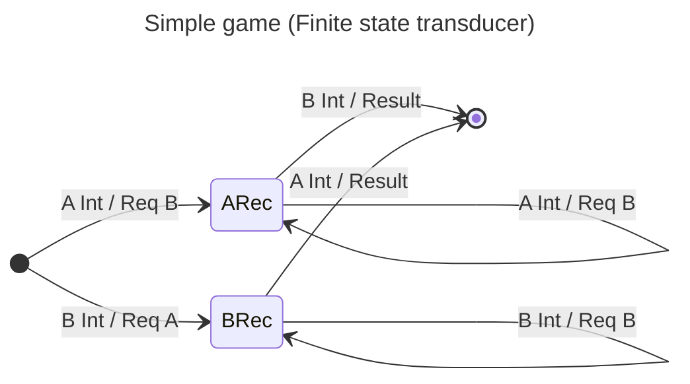

# TODO

- [ ] Learn how to create sum types in Agda so game output is either a PlayerRequest or a Result

# Introduction

This module is an initial exploration on how to define and present all the definitions for a game, a very simplistic game.

So let's start by defining a module and loading all relevant modules

```agda
module simple where

open import Data.Nat
open import Data.Fin
open import Relation.Binary.PropositionalEquality
```

Let's define a simple game that consist of 2 players. Players will be named after capital letters so we'll have `A` and `B` as players.

```agda
data Player : Set where
  A : Player
  B : Player
```

Players will be able to submit an action that is a number between 0 and 10.

```agda
-- data Move: Player → Set where
--   send : Player → Fin 10 → Move Player
```

Once actions from both players have been received the game engine compares both values and declares winner by telling the user who sent
the max value or declares a Tie when both users picked the same value.

```agda
data Request : Set where
  req : Player -> Request

data Result : Set where
  winner : Player -> Result
  tie : Result

data GameOutput : Set where
  request : Request -> GameOutput
  result : Result -> GameOutput
```

# Denotational specification

I'm going to follow the pattern of thinking of, _if another person would implement this game which are the properties I would expect_.
Let's assume that our game is a function from streams of player actions to a stream of game outputs.

1. An empty input stream produces an empty output stream
2. Any stream after the first appearance of one action from player A and another one from player B produces a stream in the form `Request :: Request .... :: Result :: []`

# Operational specification

By using transducers we can specify the game:


